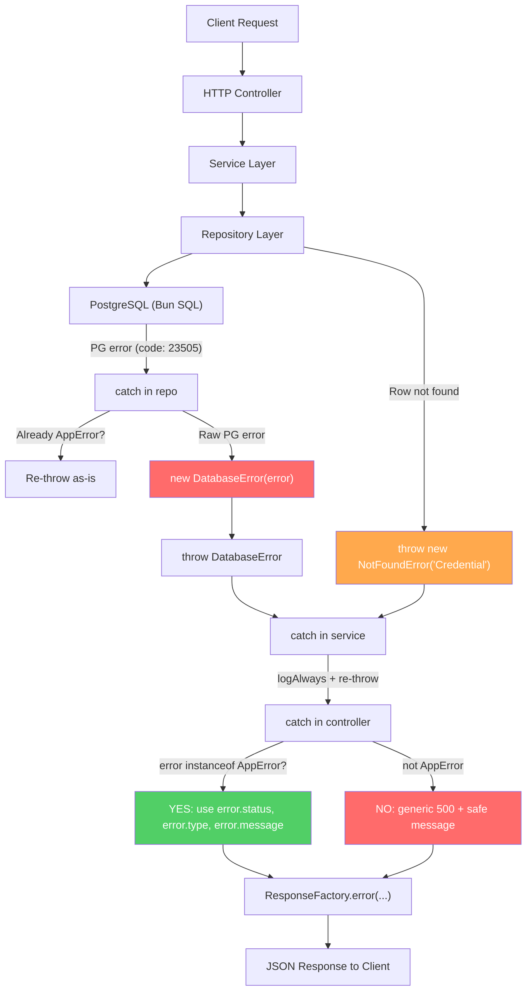

# Error Handling System — Full Design

This document describes the current and planned error handling systems.

---

## Part 1: How Errors Work RIGHT NOW (Current Setup)

The current error handling relies on string matching and manual status mapping.

### 1A. Domain Error Flow (E.g. "Credential Not Found")

Here's the exact step-by-step trace when someone tries to delete a credential that doesn't exist:

**Step 1 — HTTP Controller calls Service:**

```bash
credentailDelete (http/credentials/delete.ts)
  → deleteCredentialService(credentialId)
```

**Step 2 — Service calls Repository:**

```text
deleteCredentialService (services/credentials/delete.ts)
  → deleteCredentialRepo(credentialId)
```

**Step 3 — Repository throws a plain `Error`:**

```ts
// repository/credentials/delete.ts — line 16
if (!existing) {
  throw new Error("Credential not found");  // ← plain Error, no status, no type
}
```

**Step 4 — Repository catch re-throws:**

```ts
// repository/credentials/delete.ts — line 23-26
catch (error) {
  logAlways(error, "repo: delete query failed");
  throw error;  // ← just re-throws, no enrichment
}
```

**Step 5 — Service catch re-throws:**

```ts
// services/credentials/delete.ts — line 16-18
catch (error) {
  logAlways(error, "service: error in deleteCredentialService");
  throw error;  // ← just re-throws again, no enrichment
}
```

**Step 6 — HTTP Controller catches + maps manually:**

```ts
// http/credentials/delete.ts — line 62-80
catch (error) {
  logAlways(error, "http: error in credentailDelete controller");

  // ⚠️ Manual string comparison to decide status code
  const status =
    error instanceof Error && error.message === "Credential not found"
      ? 404
      : 500;

  return ResponseFactory.error({
    error: error instanceof Error ? error.message : "Failed to delete credential",
    message: "Failed to delete credential",
    status,
    path: { url: req.url } as BunRequest,
  });
}
```

**Client receives:**

```json
{
  "success": false,
  "error": "Credential not found",
  "message": "Failed to delete credential",
  "timestamp": "2026-06-08T05:30:00.000Z",
  "path": "http://localhost:8000/credentials/abc-123/delete",
  "status": 404
}
```

### What's Wrong with This Flow

| Problem | Where | Why it's bad |
| --------- | ------- | -------------- |
| `error.message === "Credential not found"` — fragile string match | [delete.ts:L74](file:///home/nishat/credets/apps/backend/http/credentials/delete.ts#L74), [update.ts:L74](file:///home/nishat/credets/apps/backend/http/credentials/update.ts#L74) | If someone changes the message text, the 404 breaks silently → becomes 500 |
| Status code decided at controller level only | Every controller | Status is a **domain concept** — the repo/service *knows* it's a 404, but throws a generic `Error` |
| Every controller repeats the same `instanceof Error` + string match pattern | All 5 controllers | DRY violation — same boilerplate everywhere |
| No way to tell domain error from unexpected error | The catch block | A real crash (e.g. null pointer) also hits the same catch → same treatment |

---

### 1B. Unhandled Error Flow (Current Behavior)

What happens if something truly unexpected crashes — like a bug in image processing, a null pointer,
or a type mismatch?

#### Scenario: `processImage` Throws `TypeError: Cannot Read Properties of Null`

A raw `TypeError` bubbles up from the service layer with no type-specific handler.

#### Step 1: Error Thrown in Service Layer (No Catch for This Specific Type)

The error propagates up the call stack from the service layer.

#### Step 2: Service Catch Block Catches It Generically

```ts
catch (error) {
  logAlways(error, "service: error in createCredentialService");
  throw error;  // ← re-throws the raw TypeError
}
```

**Step 3 — Controller catch block treats it exactly like a domain error:**

```ts
catch (error) {
  logAlways(error, "http: error in credentialCreate controller");
  return ResponseFactory.error({
    error: error instanceof Error ? error.message : "Internal Error",
    type: "internal-error",
    message: "Failed to create credential",
    status: 500,
    path: req,
  });
}
```

**Client receives:**

```json
{
  "success": false,
  "error": "Cannot read properties of null",
  "message": "Failed to create credential",
  "timestamp": "2026-06-08T05:30:00.000Z",
  "path": "http://localhost:8000/credentials/create",
  "status": 500,
  "type": "internal-error"
}
```

> [!WARNING]
> **Security issue:** The raw internal error message (`"Cannot read properties of null"`) is leaked
to the client. In production, this exposes implementation details.

**What about errors that escape even the controller?**

If a controller itself crashes (e.g. a typo in the handler), the error hits Bun's server-level
`error()` handler:

```ts
// index.ts — line 47-57
error(error) {
  const message = error instanceof Error ? error.message : "Internal server error";
  logAlways(error, "server error");
  return new Response(message, {
    status: 500,
    headers: { "Content-Type": "text/plain; charset=utf-8" },
  });
},
```

**Client receives plain text (NOT JSON):**

```text
Cannot read properties of null
```

> [!CAUTION]
> This response is **not JSON** — it's `text/plain`. Your frontend `response.json()` call will throw
a parse error on top of the original error. Double failure.

---

## Part 2: the New Error Handling System

This section describes the new typed error class hierarchy.

### Directory Structure

```text
apps/backend/err/
├── base.ts              ← AppError base class
├── not-found.ts         ← NotFoundError (404)
├── bad-request.ts       ← BadRequestError (400)
├── conflict.ts          ← ConflictError (409 — duplicate resource)
├── forbidden.ts         ← ForbiddenError (403)
├── unauthorized.ts      ← UnauthorizedError (401)
├── validation.ts        ← ValidationError (422 — zod/schema failures)
├── database.ts          ← DatabaseError (500 — PG-specific handling)
└── internal.ts          ← InternalError (500 — catch-all for unknown)
```

### 2A. Error Classes

**Base class — `err/base.ts`:**

```ts
export class AppError extends Error {
  public readonly status: number;
  public readonly type: string;

  constructor(message: string, status: number, type: string) {
    super(message);
    this.name = "AppError";
    this.status = status;
    this.type = type;
  }
}
```

**Domain errors — each file exports one class:**

```ts
// err/not-found.ts
import { AppError } from "./base";

export class NotFoundError extends AppError {
  constructor(resource: string) {
    super(`${resource} not found`, 404, "not-found");
    this.name = "NotFoundError";
  }
}
```

```ts
// err/bad-request.ts
import { AppError } from "./base";

export class BadRequestError extends AppError {
  constructor(message: string) {
    super(message, 400, "bad-request");
    this.name = "BadRequestError";
  }
}
```

```ts
// err/conflict.ts
import { AppError } from "./base";

export class ConflictError extends AppError {
  constructor(message: string) {
    super(message, 409, "conflict");
    this.name = "ConflictError";
  }
}
```

```ts
// err/forbidden.ts
import { AppError } from "./base";

export class ForbiddenError extends AppError {
  constructor(message = "Access denied") {
    super(message, 403, "forbidden");
    this.name = "ForbiddenError";
  }
}
```

```ts
// err/unauthorized.ts
import { AppError } from "./base";

export class UnauthorizedError extends AppError {
  constructor(message = "Authentication required") {
    super(message, 401, "unauthorized");
    this.name = "UnauthorizedError";
  }
}
```

```ts
// err/validation.ts
import { AppError } from "./base";

export class ValidationError extends AppError {
  public readonly errors: Record<string, { message: string }[]>;

  constructor(
    message: string,
    errors: Record<string, { message: string }[]>,
  ) {
    super(message, 422, "validation-error");
    this.name = "ValidationError";
    this.errors = errors;
  }
}
```

```ts
// err/internal.ts
import { AppError } from "./base";

export class InternalError extends AppError {
  constructor(message = "An unexpected error occurred") {
    super(message, 500, "internal-error");
    this.name = "InternalError";
  }
}
```

### 2B. How the Controller Catch Block Changes

**Before (current — fragile):**

```ts
catch (error) {
  logAlways(error, "http: error in credentailDelete controller");

  const status =
    error instanceof Error && error.message === "Credential not found"
      ? 404
      : 500;

  return ResponseFactory.error({
    error: error instanceof Error ? error.message : "Failed to delete credential",
    message: "Failed to delete credential",
    status,
    path: { url: req.url } as BunRequest,
  });
}
```

**After (new — clean, consistent):**

```ts
catch (error) {
  logAlways(error, "http: error in credentailDelete controller");

  if (error instanceof AppError) {
    // Domain error → status, type, message already embedded
    return ResponseFactory.error({
      error: error.message,
      type: error.type,
      message: "Failed to delete credential",
      status: error.status,
      path: { url: req.url } as BunRequest,
    });
  }

  // Unknown/unhandled error → generic 500, never leak internals
  return ResponseFactory.error({
    error: "An unexpected error occurred",
    type: "internal-error",
    message: "Failed to delete credential",
    status: 500,
    path: { url: req.url } as BunRequest,
    details: {
      originError: error instanceof Error ? error.message : "unknown error",
    },
  });
}
```

**What changed:**

- One `instanceof AppError` check replaces all string comparisons
- Domain errors carry their own status + type — no manual mapping
- Unknown errors get a **generic safe message** to the client, with `originError` in `details` for
dev debugging only
- This pattern is identical across all controllers — copy-paste consistent

### 2C. Where Errors Are Thrown (Which Layer)

| Layer | Throws What | Example |
| ------- | ------------- | --------- |
| **Repository** | `NotFoundError`, `DatabaseError` | `throw new NotFoundError("Credential")` |
| **Service** | `BadRequestError`, `ConflictError`, `ForbiddenError` | `throw new ConflictError("Credential with this title already exists")` |
| **Controller** | `BadRequestError` (for missing params like credentialId) | `throw new BadRequestError("Credential ID is required")` |
| **Validation** | `ValidationError` | Already handled via `parseAndValidateCredential` — returns error response directly |

### 2D. Repository Layer Change Example

**Before:**

```ts
// repository/credentials/delete.ts
if (!existing) {
  throw new Error("Credential not found");  // ← plain Error
}
```

**After:**

```ts
// repository/credentials/delete.ts
import { NotFoundError } from "../../err/not-found";

if (!existing) {
  throw new NotFoundError("Credential");  // ← typed error with status=404, type="not-found"
}
```

**Before (create repo — invalid type):**

```ts
if (!typeRow) {
  throw new Error(`DB Error: Credential type '${input.type}' does not exist`);
}
```

**After:**

```ts
import { BadRequestError } from "../../err/bad-request";

if (!typeRow) {
  throw new BadRequestError(`Credential type '${input.type}' does not exist`);
}
```

---

## Part 3: Unhandled Errors in the New System

How the new system handles unexpected non-domain errors.

### What Happens with the New System When a Truly Unexpected Error Occurs

This section shows the same `TypeError` scenario handled by the new system.

#### Scenario: Same `TypeError` in the New Controller Catch

This is NOT an `AppError` — it's a raw JavaScript `TypeError`.

**New controller catch handles it:**

```ts
catch (error) {
  logAlways(error, "http: error in credentialCreate controller");

  if (error instanceof AppError) {
    // ← TypeError is NOT an AppError, so this branch is skipped
  }

  // This branch catches it:
  return ResponseFactory.error({
    error: "An unexpected error occurred",     // ← safe generic message
    type: "internal-error",
    message: "Failed to create credential",
    status: 500,
    path: req,
    details: {
      originError: "Cannot read properties of null",  // ← only for dev debugging
    },
  });
}
```

**Client receives:**

```json
{
  "success": false,
  "error": "An unexpected error occurred",
  "message": "Failed to create credential",
  "timestamp": "2026-06-08T05:30:00.000Z",
  "path": "http://localhost:8000/credentials/create",
  "status": 500,
  "type": "internal-error",
  "details": {
    "originError": "Cannot read properties of null"
  }
}
```

> [!TIP]
> In production, you'd strip `details.originError` from the response entirely. For now in dev mode,
it's useful for debugging.

### Global Error Handler Update

We should also update the Bun server-level `error()` handler in
[index.ts](file:///home/nishat/credets/apps/backend/index.ts#L47-L57) to return **JSON** instead of
plain text:

**Before:**

```ts
error(error) {
  const message = error instanceof Error ? error.message : "Internal server error";
  logAlways(error, "server error");
  return new Response(message, {
    status: 500,
    headers: { "Content-Type": "text/plain; charset=utf-8" },
  });
},
```

**After:**

```ts
error(error) {
  logAlways(error, "server error");

  const status = error instanceof AppError ? error.status : 500;
  const type = error instanceof AppError ? error.type : "internal-error";
  const message = error instanceof AppError
    ? error.message
    : "An unexpected error occurred";

  return Response.json(
    {
      success: false,
      error: message,
      type,
      message: "Server error",
      timestamp: new Date().toISOString(),
      status,
    },
    {
      status,
      headers: ResponseFactory.getCorsHeaders(),  // need to make this public
    },
  );
},
```

> [!IMPORTANT]
> This requires making `ResponseFactory.getCorsHeaders()` public (remove `private`). This ensures
even catastrophic errors return proper JSON with CORS headers.

---

## Part 4: Database Errors (PostgreSQL)

Handling PostgreSQL-specific errors from Bun's SQL driver.

### 4A. How DB Errors Work RIGHT NOW

Bun's built-in `SQL` driver (used in
[connection.ts](file:///home/nishat/credets/apps/backend/db/connection.ts)) throws errors with
PostgreSQL-specific properties when a query fails.

**Common PG error scenarios in your schema:**

| Scenario | PG Error Code | Current Behavior |
| ---------- | -------------- | ----------------- |
| Duplicate unique key (e.g. same `username`) | `23505` | Raw error thrown → caught as generic 500 |
| Foreign key violation (e.g. invalid `types_id`) | `23503` | Raw error thrown → caught as generic 500 |
| Not-null violation (e.g. missing `title`) | `23502` | Raw error thrown → caught as generic 500 |
| Connection timeout / pool exhausted | N/A | Raw error thrown → caught as generic 500 |
| Invalid UUID format in WHERE clause | `22P02` | Raw error thrown → caught as generic 500 |

**Current: what a PG error looks like when it hits the controller:**

When a unique constraint violation occurs (e.g. inserting a duplicate), Bun's SQL throws something
like:

```text
PostgresError: duplicate key value violates unique constraint "users_username_idx"
  DETAIL: Key (username)=(admin) already exists.
  code: "23505"
  schema: "public"
  table: "users"
  constraint: "users_username_idx"
```

**But your controller sees it as:**

```ts
catch (error) {
  // error instanceof Error → true
  // error.message → "duplicate key value violates unique constraint \"users_username_idx\""
  // error.code → "23505" (but nobody checks this!)
  
  return ResponseFactory.error({
    error: error instanceof Error ? error.message : "Internal Error",
    // ↑ This raw PG message goes straight to the client!
    status: 500,
    ...
  });
}
```

**Client currently receives:**

```json
{
  "success": false,
  "error": "duplicate key value violates unique constraint \"users_username_idx\"",
  "message": "Failed to create credential",
  "status": 500
}
```

> [!CAUTION]
> **Security issue #2:** The raw PostgreSQL error exposes internal table names, constraint names,
and schema details to the client.

### 4B. The DatabaseError Class

```ts
// err/database.ts
import { AppError } from "./base";

/**
 * Friendly mappings for common PostgreSQL error codes.
 *
 * Reference: https://www.postgresql.org/docs/current/errcodes-appendix.html
 */
const PG_ERROR_MAP: Record<string, { status: number; message: string }> = {
  "23505": { status: 409, message: "Resource already exists" },          // unique_violation
  "23503": { status: 400, message: "Referenced resource does not exist" }, // foreign_key_violation
  "23502": { status: 400, message: "Required field is missing" },         // not_null_violation
  "23514": { status: 400, message: "Value does not meet requirements" },  // check_violation
  "22P02": { status: 400, message: "Invalid input format" },              // invalid_text_representation
  "08006": { status: 503, message: "Database connection lost" },          // connection_failure
  "08001": { status: 503, message: "Unable to connect to database" },     // sqlclient_unable_to_establish_sqlconnection
  "57014": { status: 504, message: "Query timed out" },                   // query_canceled
  "53300": { status: 503, message: "Too many connections" },              // too_many_connections
  "40P01": { status: 500, message: "Database deadlock detected" },        // deadlock_detected
};

export class DatabaseError extends AppError {
  public readonly pgCode: string | undefined;
  public readonly pgDetail: string | undefined;
  public readonly pgTable: string | undefined;
  public readonly pgConstraint: string | undefined;

  constructor(originalError: unknown) {
    // Extract PG-specific fields from Bun SQL errors
    const pgCode =
      originalError && typeof originalError === "object" && "code" in originalError
        ? String((originalError as Record<string, unknown>).code)
        : undefined;

    const pgDetail =
      originalError && typeof originalError === "object" && "detail" in originalError
        ? String((originalError as Record<string, unknown>).detail)
        : undefined;

    const pgTable =
      originalError && typeof originalError === "object" && "table" in originalError
        ? String((originalError as Record<string, unknown>).table)
        : undefined;

    const pgConstraint =
      originalError && typeof originalError === "object" && "constraint" in originalError
        ? String((originalError as Record<string, unknown>).constraint)
        : undefined;

    // Look up a friendly message, or fall back to generic
    const mapped = pgCode ? PG_ERROR_MAP[pgCode] : undefined;
    const status = mapped?.status ?? 500;
    const message = mapped?.message ?? "A database error occurred";

    super(message, status, "database-error");
    this.name = "DatabaseError";
    this.pgCode = pgCode;
    this.pgDetail = pgDetail;
    this.pgTable = pgTable;
    this.pgConstraint = pgConstraint;
  }
}
```

### 4C. How to Use DatabaseError in the Repository Layer

**The key idea:** The repository layer wraps raw PG errors into `DatabaseError` before re-throwing.
The controller never sees raw PG errors.

```ts
// repository/credentials/create.ts — updated catch block
import { DatabaseError } from "../../err/database";

export async function createCredentialRepo(input: CreateCredentialRepoInput) {
  logAlways(input.title, "repo: starting db transaction for create");

  try {
    return await sql.begin(async (sql) => {
      // ... existing query logic ...
    });
  } catch (error) {
    logAlways(error, "repo: db insert query failed");

    // If it's already an AppError (like NotFoundError), just re-throw
    if (error instanceof AppError) {
      throw error;
    }

    // Otherwise it's a raw PG/driver error → wrap it
    throw new DatabaseError(error);
  }
}
```

**What the controller now sees:**

```ts
catch (error) {
  if (error instanceof AppError) {
    // DatabaseError IS an AppError!
    // error.status → 409 (for duplicate key)
    // error.type → "database-error"
    // error.message → "Resource already exists" (safe, no internals leaked)
    return ResponseFactory.error({
      error: error.message,
      type: error.type,
      status: error.status,
      ...
    });
  }
}
```

**Client now receives (for a duplicate key):**

```json
{
  "success": false,
  "error": "Resource already exists",
  "message": "Failed to create credential",
  "timestamp": "2026-06-08T05:30:00.000Z",
  "path": "http://localhost:8000/credentials/create",
  "status": 409,
  "type": "database-error"
}
```

**vs what they received before:**

```json
{
  "success": false,
  "error": "duplicate key value violates unique constraint \"users_username_idx\"",
  "status": 500
}
```

### 4D. Full Data Flow Diagram (New System)



---

## Part 5: Summary — Every Error Type and Its Output

Quick reference for all error types and their HTTP responses.

### Domain Errors (Thrown Explicitly by Our Code)

| Error Class | Status | Type | Example Message | Thrown From |
| ------------- | -------- | ------ | ----------------- | ------------- |
| `NotFoundError` | 404 | `not-found` | `"Credential not found"` | Repository |
| `BadRequestError` | 400 | `bad-request` | `"Credential ID is required"` | Controller / Repository |
| `ConflictError` | 409 | `conflict` | `"Credential with this title already exists"` | Service |
| `ForbiddenError` | 403 | `forbidden` | `"Access denied"` | Service |
| `UnauthorizedError` | 401 | `unauthorized` | `"Authentication required"` | Service / Middleware |
| `ValidationError` | 422 | `validation-error` | `"Validation failed"` | Validation layer |

### Database Errors (Caught from PG, Wrapped Automatically)

| PG Code | Status | Client Message | Real PG Message (hidden) |
| --------- | -------- | ---------------- | -------------------------- |
| `23505` | 409 | `"Resource already exists"` | `duplicate key value violates unique constraint...` |
| `23503` | 400 | `"Referenced resource does not exist"` | `insert or update on table... violates foreign key...` |
| `23502` | 400 | `"Required field is missing"` | `null value in column "title" violates not-null constraint` |
| `22P02` | 400 | `"Invalid input format"` | `invalid input syntax for type uuid: "not-a-uuid"` |
| `08006` | 503 | `"Database connection lost"` | `connection terminated unexpectedly` |
| `57014` | 504 | `"Query timed out"` | `canceling statement due to statement timeout` |

### Unhandled Errors (Bugs, Crashes)

| Scenario | Status | Client Message | Details (dev only) |
| ---------- | -------- | ---------------- | -------------------- |
| TypeError, ReferenceError, etc. | 500 | `"An unexpected error occurred"` | `originError: "Cannot read properties of null"` |

---

## Part 6: Implementation Checklist

> [!IMPORTANT]
> All files to create/modify are listed below. No existing functionality will break — `AppError
extends Error`, so `instanceof Error` still works everywhere.

### Files to CREATE

| File | Purpose |
| ------ | --------- |
| `apps/backend/err/base.ts` | `AppError` base class |
| `apps/backend/err/not-found.ts` | `NotFoundError` (404) |
| `apps/backend/err/bad-request.ts` | `BadRequestError` (400) |
| `apps/backend/err/conflict.ts` | `ConflictError` (409) |
| `apps/backend/err/forbidden.ts` | `ForbiddenError` (403) |
| `apps/backend/err/unauthorized.ts` | `UnauthorizedError` (401) |
| `apps/backend/err/validation.ts` | `ValidationError` (422) |
| `apps/backend/err/database.ts` | `DatabaseError` (500/409/400 based on PG code) |
| `apps/backend/err/internal.ts` | `InternalError` (500 catch-all) |
| `docs/error-handling.md` | Documentation for the entire system |

### Files to MODIFY

| File | What Changes |
| ------ | ------------- |
| `apps/backend/index.ts` | Global `error()` handler → return JSON + AppError-aware |
| `apps/backend/utils/response.ts` | Make `getCorsHeaders()` public |
| `apps/backend/repository/credentials/create.ts` | `throw new NotFoundError` / `DatabaseError` wrapper |
| `apps/backend/repository/credentials/update.ts` | Same pattern |
| `apps/backend/repository/credentials/delete.ts` | Same pattern |
| `apps/backend/http/credentials/create.ts` | `instanceof AppError` catch pattern |
| `apps/backend/http/credentials/update.ts` | Same pattern |
| `apps/backend/http/credentials/delete.ts` | Same pattern |
| `apps/backend/http/credentials/credential.ts` | Same pattern |
| `apps/backend/http/credentials/listings.ts` | Same pattern |
